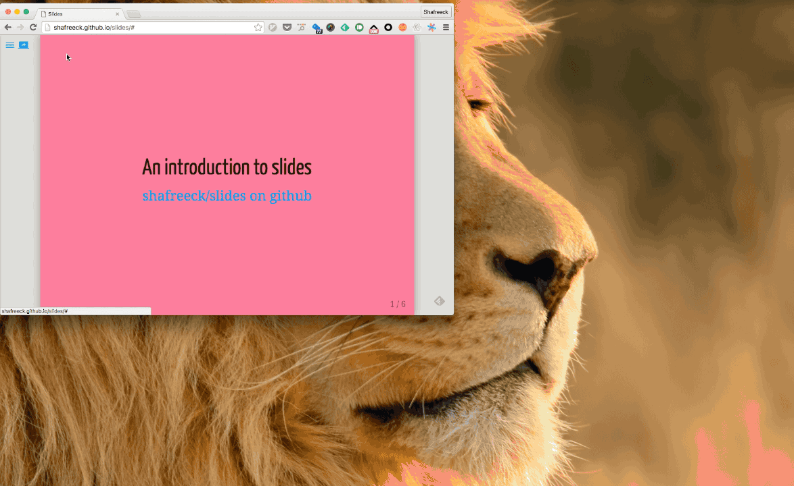

# Slides

Slides is a Slide Sync solution based on remarkjs and mqtt

* [Remarkjs](http://remarkjs.com/) renders markdown to slide presentations
* [MQTT](http://mqtt.org/) A pub/sub message protocol, slides use the public test.mosquitto.org now
* You can make slides use your private mqtt brokers



#### Demo
* See the [demo](http://shafreeck.github.io/slides) here

#### Editing
* Use [slides-preview](http://github.com/shafreeck/slides-preview) in atom to make it easy to preview your markdown

## Building

```
npm install
npm run-script release
```

The generated files will locate at dist/, Publish it to your web servers.

## Development

```
npm run-script dev
```

Start a local web server which based on webpack-dev-server
